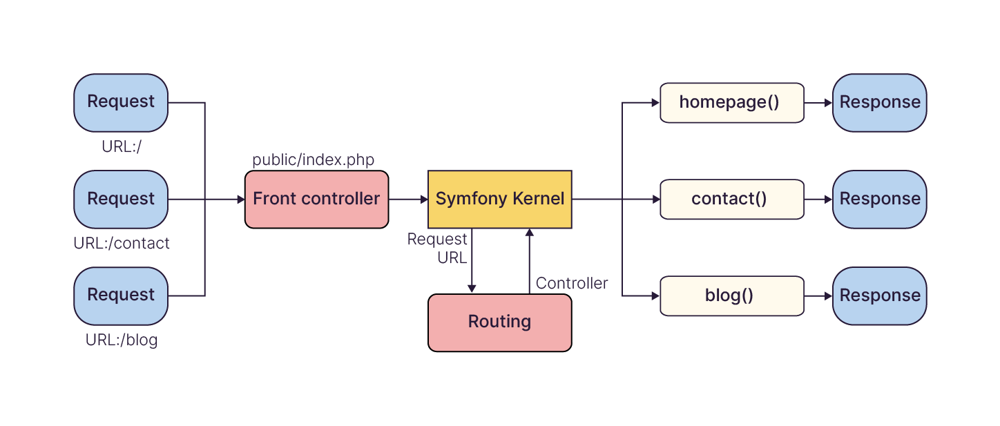

# Virtual-library

Je réalise ce projet pour monter en compétence en programmation web avec php. J'ai choisi de le faire à l'aide de Symfony.

Symfony est un framework PHP qui permet de construire des applications web en fournissant des composants et des outils pour gérer des interactions basées sur HTTP.
> Voici à quoi ressembel le traitement d'une requête dans Symfony :
> 

## Table des matières

- [Description](README.md)

## Description

rendre accessible au public un catalogue virtuel d'une médiathèque, pour que chaque visiteur puisse consulter les livres disponibles ainsi que leur statut d'emprunt.
